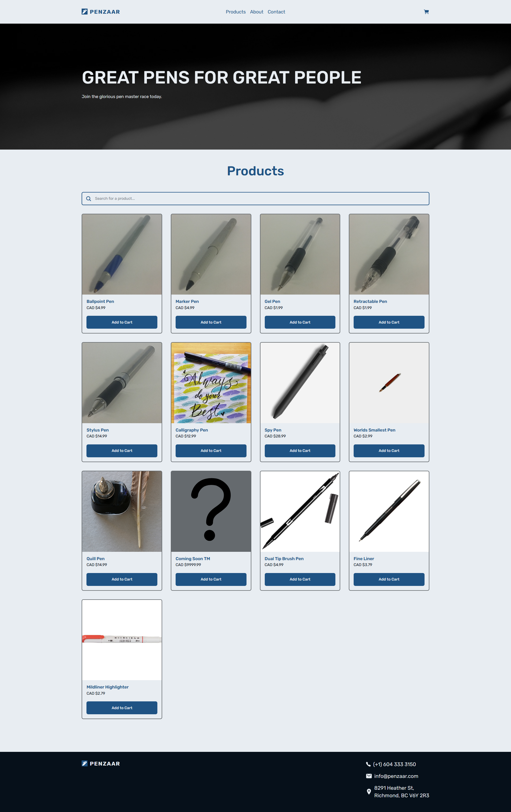
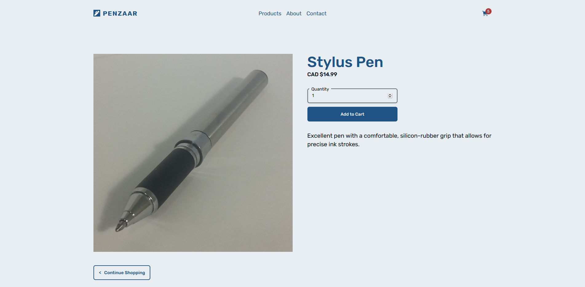
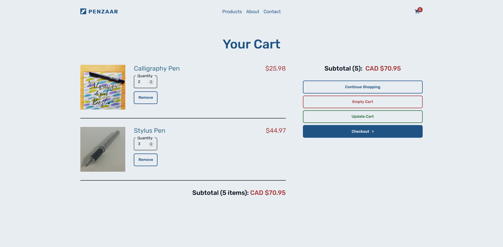
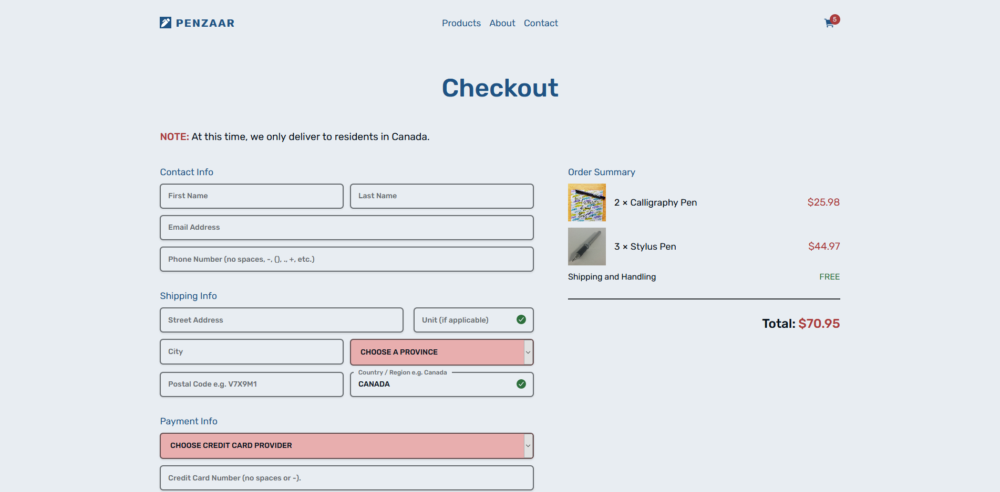
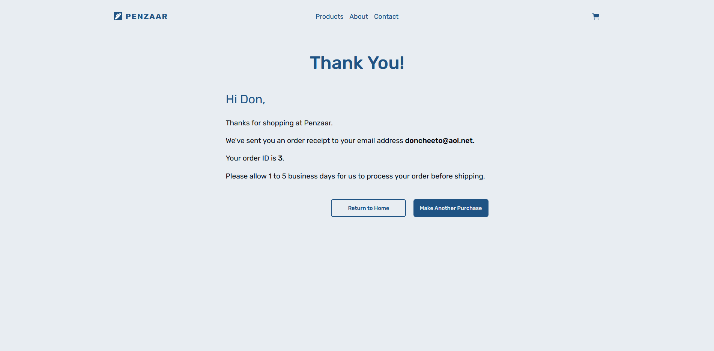
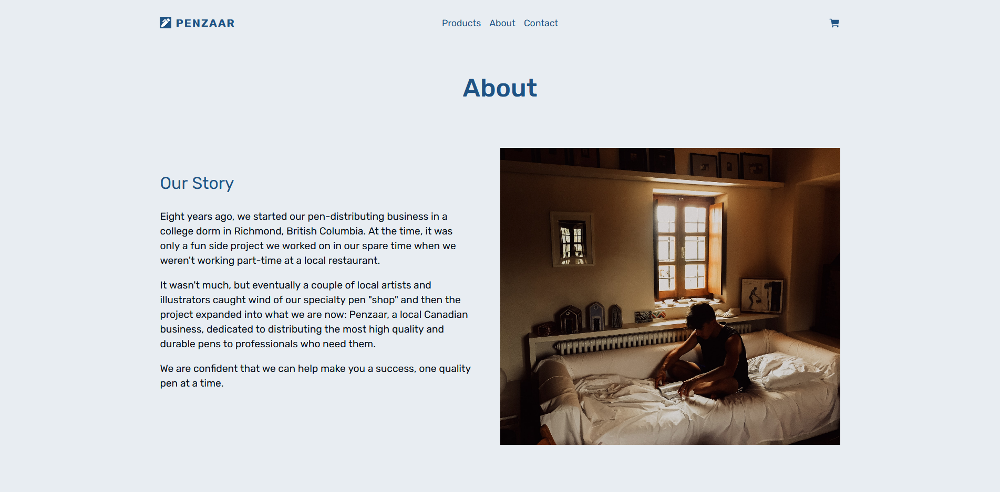
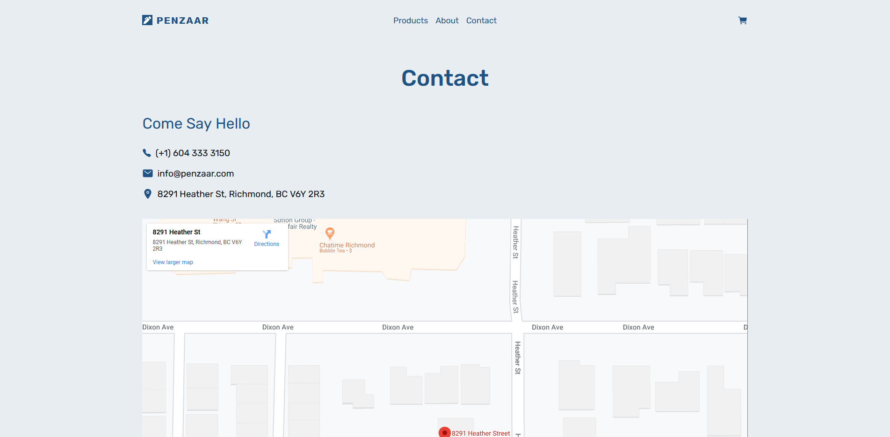
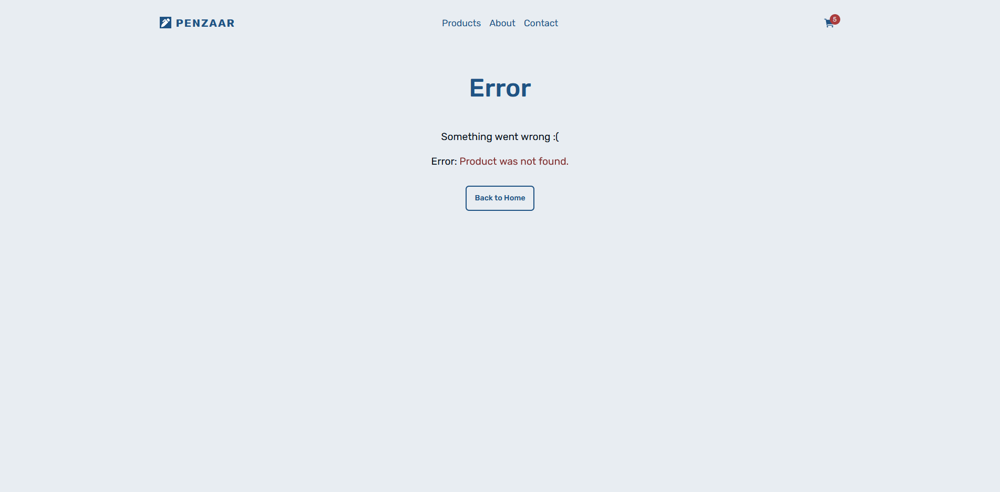

# INFO3150-Project: Penzaar

Penzaar is the course project for the class INFO 4125: Website and Cloud Security.
This is an ecommerce web application created with vanilla HTML, CSS, JavaScript, PHP, and MariaDB.
It features the following:

- Session-based shopping cart with full CRUD functionality (Cart, Product, ProductDetail, and Checkout pages)
- Retrieves data from and adds data to the database (CREATE and READ functionality)
- 2 static pages (About and Contact pages)
- 6 dynamic pages (Error, Products, ProductDetail, Cart, Checkout, and OrderSubmited pages)
- ALL pages
  - tracks number of items in the shopping cart
  - mobile-first, fully responsive web design (supports mobile, tablet, and desktop devices)
  - shows number of cart items on shopping cart icon when the user has at least 1 cart item
- Home / Products page
  - retrieves product data
  - allows instant search (searchbox) function
  - allows users to add product to their cart
- ProductDetail page
  - retrieves data about a specific product
  - allows users to add a specified quantity of the product to their cart
- Cart page
  - allows users to view all products in their cart
  - allows users to delete a specific product or delete all products from their cart
  - allows users to edit and update the quantity of any products in their cart
  - allows users to proceed to checkout
- Checkout page
  - live form validation
    - shows custom invalid input messages for certain inputs e.g. credit card number
    - shows checkmark icon besides each input when the input is valid
    - complete frontend form validation for credit card payment info
    - partial frontend form validation for non-credit-card related info
  - shows summary of cart product items and other costs
- OrderSubmitted page
  - submits order information to the database ( tables `PurchaseOrder` and `PurchaseOrderItem` tables respectively)
  - empties shopping cart
  - thanks user by name and notifies them that a receipt has been sent to their email address (doesn't actually send the email)
- Error page
  - shows a different error message depending on which page the user attempted to visit or add submit information to

SVGs graphics from the [Ionicons icon library](https://ionicons.com/) were used.
No other third party libraries, frameworks, templating engines, etc. were used.

<!-- ## UX Demos (Desktop)

### Instant product search functionality.

### Cart CRUD functionality.

### Credit card live validation functionality.

 -->

<!-- ## UX Demo (Pseudo Mobile)

### Instant product search functionality.

### Cart CRUD functionality.

### Credit card live validation functionality.

### Mobile Demo

## UI Screenshots

### Home / Products (Full) Page -->

## UI Screenshots

### Home / Products (Full) Page

### Product Detail Page

### Cart Page

### Checkout Page

### Order Submitted Page

### About Page

### Contact Page

### Error Page

## How to Install (in a local environment)

1. Install [XAMPP](https://www.apachefriends.org/index.html).
2. If you want to download and install the project folder from a ZIP file (not recommended), skip this step and go to step 3. Use [Git Bash](https://git-scm.com/downloads) or the [GitHub Desktop client](https://desktop.github.com/) to clone the project to the `/htdocs` folder of your XAMPP or LAMP installation folder. For example, the project folder might be moved to `C:\xampp\htdocs\INFO4125-Project`. If the project folder's name is NOT `INFO4125-Project`, rename the folder to that.
3. Download (not recommended) the [ZIP file for this repository](https://github.com/JunYuHuang/INFO4125-Project/archive/master.zip) and extract it to your desktop. Move the innermost folder `PROJECT4125-Project` to the `/htdocs` folder of your XAMPP installation folder. For example, the project folder might be moved to `C:\xampp\htdocs\PROJECT4125-Project-master`. Rename the folder that you moved from `INFO4125-Project-master` to `PROJECT4125-Project`.
4. Run the MySQL script `createDB.sql` inside the folder `/INFO4125-Project/databaseScript/` in PHPMyAdmin.
5. In PHPMyAdmin, click on the `PenzaarDB` database and look at the `Privileges` tab. Check if there is a user account named `PenzaarUser` with `ALL` privileges on the `PenzaarDB` database. If not, create such a MySQL database account in PHPMyAdmin with the password being the same as the username and with the `ALL` privileges.

## How to Run (in a local environment)

1. Launch the XAMPP control panel
2. Start both the `Apache` and `MySQL` services.
3. Open a new browser window or tab and go to `localhost/INFO4125-Project`.

## Other Notes

- There is no option to add new products to the database.
- Internet Explorer or Microsoft Edge is not supported; please use the latest versions of Chrome, Firefox, Safari, or any other modern web browser.
- The database script `createDB.sql` must be manually updated and run (copied and pasted to the database's "SQL" tab and then click "GO") in PHPMyAdmin to add new products.

## UX/UI Suggestions

- ~~Allow users to add items to cart from Product page.~~ DONE
- ~~Put important contact information in footer (for SEO).~~ DONE
- ~~Make the Product page the home page. Can shink and put hero header of current home page on top of Product page.~~ DONE
- Auto-update cart when a user updates and leaves (onblur) the quantity of a cart item instead of forcing users to manually click Update button to update the cart.
- Remove credit card provider dropdown input on checkout page because can determine card provider and security code length based on credit card number.
- Show dropdown notification instead of redirecting to Cart page when user adds items to the cart.
- Show recommended products on each ProductDetail page.
- Fix slight colour contrast issues with hero header and background colour.
- Improve overall colour palette and fonts.
